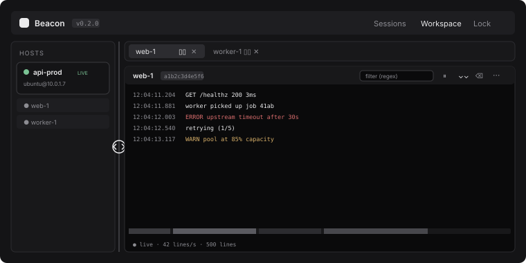

<div align="center">


# Beacon

**One window for every container log across every server you SSH into.**

Browse `docker ps` on any host you can reach over SSH, stream container logs into a
searchable, virtualised workspace, and keep the credentials for it all in an encrypted
local vault.

Cross-platform · local-only · no account, no cloud, no telemetry.

</div>

---

<div align="center">

</div>

---

## Why

> "I have a dozen EC2 hosts. Each runs a handful of containers. When something breaks I
> want to see *all* the relevant logs side by side, filter them, jump to a moment in
> time — without juggling six terminals."

That is the whole idea. Beacon replaces the row of terminal tabs running `docker logs -f`
with a single window that remembers your servers.

## Features

**Connect**

- SSH with key, password, or through a **jump host** — plus **AWS SSM** tunnelling for
  instances with no public port, resolved by instance ID, tag filters, or Auto Scaling Group.
- Encrypted vault for every credential. Optional **auto-unlock** via your OS keychain.
- Categories, plus encrypted **import/export** for moving between machines.

**Read logs**

- Virtualised log viewer that stays smooth at thousands of lines a second.
- Regex filtering with saved presets, highlight rules, and regex **alerts** that raise
  desktop notifications.
- **Split panes** with a diff mode that lines two streams up and tints what differs.
- Time-density scrubber, JSON pretty-printing, container stats, horizontal scrolling for
  long lines.
- Rolling local **archive** so history survives a disconnect, plus export to `.txt` /
  `.json` and optional **S3 backup**.

**Operate**

- Opens **your own terminal app** over SSH — Terminal, Windows Terminal, or your Linux
  emulator — with the key, port, jump host and SSM proxy already wired up.
- Saved **upgrade flows**: a per-server list of commands, run with live output and
  interactive prompts, with logs backed up to S3 first.

**Stay current**

- Signed **auto-update** from GitHub releases, checked on launch and every six hours.
- Built-in [user guide](docs/user-guide.md), available on the **Guide** tab in the app.

## Install

Grab the latest build for your platform from the
[releases page](https://github.com/PSNAppz/Beacon/releases).

| OS | File |
| --- | --- |
| macOS (Apple Silicon) | `Beacon_x.y.z_aarch64.dmg` |
| macOS (Intel) | `Beacon_x.y.z_x64.dmg` |
| Windows | `.msi` or `.exe` |
| Linux | `.AppImage`, `.deb`, or `.rpm` |

> **macOS first launch.** Beacon is not signed with an Apple Developer certificate, so
> Gatekeeper will say it "cannot be verified". Right-click the app and choose **Open** to
> allow it once, or run
> `xattr -dr com.apple.quarantine /Applications/Beacon.app`.
> This applies to the first install only — updates Beacon applies to itself are unaffected.
>
> **Windows** shows a SmartScreen warning on first install for the same reason.

After that, Beacon updates itself in place. You will not download an installer again.

## Documentation

- **[User guide](docs/user-guide.md)** — everything from first run to troubleshooting,
  with diagrams. Also on the **Guide** tab inside the app.
- **[UI overhaul plan](docs/ui-overhaul.md)** — design-system direction and phased work.
- **[Backdrop & auto-update notes](docs/plan-ui-and-auto-update.md)** — how updates are
  signed and released.

---

## Architecture

```
┌───────────────────────────── Tauri App ─────────────────────────────┐
│  Frontend (system webview)                Rust core (tokio)         │
│  ┌──────────────────────────┐   invoke    ┌──────────────────────┐  │
│  │ React + TypeScript       │ ──────────▶ │ Tauri command        │  │
│  │  • Lock screen / vault   │             │  handlers            │  │
│  │  • Sessions + wizard     │ ◀────────── │                      │  │
│  │  • Workspace             │   events    └──────┬───────────────┘  │
│  │    - virtualised logs    │                    │                  │
│  │    - host tree, tabs     │            ┌───────▼───────────────┐  │
│  │    - command palette     │            │ Session manager       │  │
│  │  • Settings, Guide       │            │  • russh clients      │  │
│  └──────────────────────────┘            │  • ProxyJump bastion  │  │
│                                          │  • SSM websocket      │  │
│                                          │  • heartbeat + retry  │  │
│                                          └───────┬───────────────┘  │
│                                          ┌───────▼───────────────┐  │
│                                          │ Subsystems            │  │
│                                          │  • LogStream          │  │
│                                          │    (docker logs -f)   │  │
│                                          │  • Stats poller       │  │
│                                          │  • Log archiver       │  │
│                                          │  • Upgrade runner     │  │
│                                          │  • S3 uploader        │  │
│                                          │  • External terminal  │  │
│                                          └───────┬───────────────┘  │
│                                          ┌───────▼───────────────┐  │
│                                          │ Vault                 │  │
│                                          │  • SQLite (rusqlite)  │  │
│                                          │  • Argon2id KDF       │  │
│                                          │  • ChaCha20-Poly1305  │  │
│                                          │  • OS keychain (opt)  │  │
│                                          └───────────────────────┘  │
└─────────────────────────────────────────────────────────────────────┘
```

### Tech stack

| Layer | Choice |
| --- | --- |
| Shell | Tauri 2 (Rust core + system webview) |
| Backend | Rust, tokio async runtime |
| SSH | `russh` + `russh-keys` (PEM/OpenSSH, password, ProxyJump) |
| AWS | `aws-sdk-ssm` / `-ec2` / `-autoscaling` / `-s3` — no CLI needed to connect |
| Storage | SQLite via `rusqlite` (bundled), no system dependency |
| Crypto | Argon2id KDF + ChaCha20-Poly1305 AEAD on secret fields |
| Keychain | `keyring` — Keychain / Credential Manager / Secret Service |
| Updates | `tauri-plugin-updater`, minisign-signed GitHub releases |
| Frontend | React 18 + TypeScript + Vite |
| Styling | Tailwind CSS, monochrome token palette |
| Primitives | Radix UI + `cva`, `lucide-react` icons |
| Layout | `react-resizable-panels` |
| Log list | `@tanstack/react-virtual` |
| Backdrop | Canvas dot grid (React Bits) + `gsap` |
| State | Zustand |

### Security model

- A **master password** set on first launch. It never touches disk.
- A 32-byte vault key is derived with **Argon2id** (m=64MiB, t=3, p=1) over a random
  16-byte salt stored in the database.
- Secret fields — key passphrases, host passwords, AWS secret keys — are encrypted with
  **ChaCha20-Poly1305** (`nonce ‖ ciphertext+tag`, base64). Non-secret metadata (host,
  user, key file path) is stored as plaintext in the row.
- A short verifier blob is encrypted at vault creation. Unlock decrypts it; AEAD failure
  means a wrong password.
- **Remember this password** is opt-in and stores the master password in the OS credential
  store, never in Beacon's own files. Anyone who can log in as you can then open the vault
  — the trade-off is spelled out in the app and the user guide.
- Changing the master password re-encrypts every stored secret under the new key, and
  updates the remembered copy so auto-unlock keeps working.
- Locking the vault disconnects every live SSH session. So does quitting the app.
- Stored passwords are deliberately **not** passed to the external terminal, which would
  put a secret on a command line other processes can read.

Data locations:

| OS | Vault |
| --- | --- |
| Windows | `%APPDATA%\Beacon\vault.db` |
| macOS | `~/Library/Application Support/Beacon/vault.db` |
| Linux | `~/.local/share/Beacon/vault.db` |

Delete the file to reset the vault. The log archive is a separate database in the same
directory and holds log text, not credentials.

### Repository layout

```
Beacon/
├── src-tauri/                   # Rust core
│   ├── src/
│   │   ├── lib.rs               # Tauri builder + command registry
│   │   ├── commands.rs          # #[tauri::command] handlers
│   │   ├── crypto.rs            # Argon2id KDF + ChaCha20-Poly1305
│   │   ├── secretstore.rs       # OS keychain (remembered password)
│   │   ├── terminal.rs          # launches the native terminal over SSH
│   │   ├── archive.rs           # rolling local log archive
│   │   ├── transfer.rs          # encrypted session import/export
│   │   ├── s3.rs                # log backup
│   │   ├── storage/             # vault, sessions, categories, upgrade flows
│   │   └── ssh/                 # russh client, manager, docker, SSM
│   ├── capabilities/            # Tauri permission scopes
│   └── tauri.conf.json
├── src/                         # React frontend
│   ├── app/                     # App shell, pages, Guide
│   ├── features/                # sessions, rules, upgrades, s3
│   ├── components/              # ui.tsx primitives, DotGrid, AppBackground
│   ├── content/                 # user-guide.md + diagrams (source of truth)
│   └── lib/                     # ipc, stores, helpers
├── docs/                        # generated user guide + planning docs
├── scripts/                     # build helpers
└── .github/workflows/release.yml
```

---

## Development

You need a **Rust toolchain**, **Node.js 20+**, and your OS's webview build prerequisites.
The first Rust compile takes several minutes; after that it is incremental.

> **Rust 1.91 or newer is required.** Some AWS SDK dependencies will not build on older
> compilers. If `cargo` reports "requires rustc 1.91", upgrade with `rustup update stable`
> — and note that a Homebrew-installed Rust can shadow a newer rustup toolchain on `PATH`.

### macOS

```bash
xcode-select --install
npm install
npm run tauri dev
```

### Windows

Install the [WebView2 runtime](https://developer.microsoft.com/microsoft-edge/webview2/)
(preinstalled on Windows 11) and the MSVC "Desktop development with C++" build tools, then:

```powershell
npm install
npm run tauri dev
```

### Linux (Ubuntu / Debian)

```bash
sudo apt update
sudo apt install -y libwebkit2gtk-4.1-dev build-essential curl wget file \
  libxdo-dev libssl-dev libayatana-appindicator3-dev librsvg2-dev
npm install
npm run tauri dev
```

For other distributions see the [Tauri Linux prerequisites](https://v2.tauri.app/start/prerequisites/#linux).

### Useful scripts

| Command | Does |
| --- | --- |
| `npm run tauri dev` | Run the app with frontend hot-reload |
| `npm run tauri build` | Production bundle in `src-tauri/target/release/bundle/` |
| `npm run docs:sync` | Regenerate `docs/user-guide.md` from `src/content/` |
| `npm run clean:dmg` | Detach stale macOS DMG mounts left by an interrupted build |

Editing the user guide: change `src/content/user-guide.md`, never the copy in `docs/`.
It is compiled into the app and mirrored to `docs/` on every build.

### Releasing

Updates are signed with a minisign key held in the repo secrets
`TAURI_SIGNING_PRIVATE_KEY` and `TAURI_SIGNING_PRIVATE_KEY_PASSWORD`. Losing that key
means no installed copy can ever accept an update again — back it up.

```bash
npm version patch          # bumps package.json and tauri.conf.json
git push --follow-tags
```

Pushing a `v*` tag runs [`release.yml`](.github/workflows/release.yml), which builds macOS
(arm64 + x64), Windows and Linux, signs the updater artifacts, and publishes a release
with `latest.json`. Running clients pick it up within six hours, or immediately via
**Settings → Updates → Check now**.

The release must **not** be a draft — the updater resolves
`releases/latest/download/latest.json`, which skips drafts.

---

## Roadmap

Shipped: vault and session management, Docker listing and live streaming, the workspace
(tabs, splits, host tree, command palette), saved filters, highlights and alerts, stats,
archive, diff and export, SSM and S3, upgrade flows, external terminal, auto-update.

In progress — see [ui-overhaul.md](docs/ui-overhaul.md) for the phased plan:

- Log surface: ANSI colour, sticky timestamp gutter, in-buffer search, per-line actions
- Sessions list with search, sort and bulk actions
- Custom title bar and left navigation rail
- Light theme
- Line wrapping

Post-MVP candidates: Kubernetes pods alongside `docker ps`, a plugin API, known_hosts
verification with a TOFU prompt.

## License

TBD.
