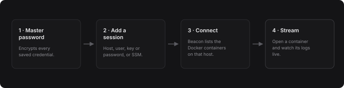
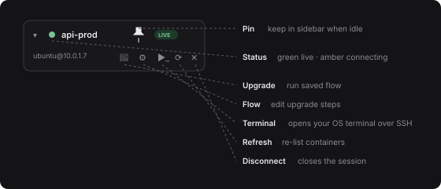
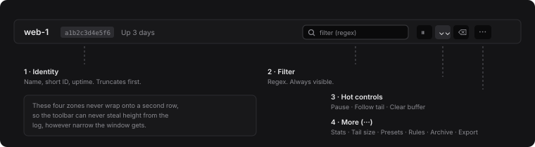

# Beacon User Guide

Beacon connects to your servers over SSH, finds the Docker containers running on
them, and streams their logs into one window. It keeps the credentials for those
servers in an encrypted vault on your machine, so you are not re-typing hosts and
key paths every morning.

If you have ever kept six terminal tabs open running `docker logs -f`, that is the
job Beacon is trying to replace.

---

## 1. First run

### Creating your vault

The first time Beacon opens it asks you to create a **master password**. This
password encrypts every credential you go on to save — SSH key passphrases, server
passwords and AWS secret keys.

Two things to understand before you choose it:

- **It is never stored anywhere.** Beacon derives a key from it in memory. There is
  no recovery, no reset link and no back door.
- **If you forget it, the vault is gone.** Your saved sessions cannot be decrypted
  by anyone, including you. You would start over with an empty vault.

Use at least 8 characters. A password manager entry is a good idea.

### Remember this password

The unlock screen has a **Remember this password** tick box. Leave it ticked and
Beacon stores the master password in your operating system's own credential
store — Keychain on macOS, Credential Manager on Windows, Secret Service on
Linux — and unlocks itself automatically the next time you launch it.

This is a genuine trade-off, so make the choice deliberately:

- **Ticked** is convenient, and reasonable on a machine only you use, with full
  disk encryption and a login password. Anyone who can log in as you can now open
  Beacon and use your saved servers.
- **Unticked** means you type the password on every launch, and a stolen machine
  gives up nothing.

You can change your mind later in **Settings → Vault → Remembered password →
Forget**. Because auto-unlock means you may never see the unlock screen again,
that Settings entry is the only way back out.

### Locking

**Lock** in the top right locks the vault immediately. This also disconnects every
live SSH session — Beacon will not hold connections open behind a locked vault.

---

## 2. Sessions

The **Sessions** page is your address book of servers. Each card is one host.

Click a card, or its **Connect** button, to connect and jump straight to the
Workspace.

### Adding a session

**+ New session** opens the session editor. The fields that matter:

| Field | Notes |
|---|---|
| **Name** | What you will recognise it by. Shown on tabs and in the sidebar. |
| **Host / Port** | Hostname or IP. Port defaults to 22. |
| **Username** | The SSH user. |
| **Authentication** | Key, password, or agent — see below. |
| **Colour** | An identity dot shown on the card, sidebar and tabs. Useful for telling production from staging at a glance. |
| **Category** | Groups sessions into sections. Manage the list in Settings. |
| **Jump host** | Another saved session to route through (an SSH bastion). |
| **Read-only / sudo** | Read-only marks the host so you treat it carefully; sudo prefixes remote Docker commands. |

### Authentication types

- **Key** — point Beacon at a private key file. If the key has a passphrase, enter
  it and Beacon stores it encrypted in the vault.
- **Password** — stored encrypted in the vault. Note that the external terminal
  will still prompt you for it; see [Opening a terminal](#6-opening-a-real-terminal).
- **Agent** — not yet implemented.

> **Key file permissions.** SSH refuses to use a private key that other users on
> your machine can read. Beacon's own connections do not care, so a session can
> work perfectly in the Workspace and still fail the moment you open a terminal.
> If that happens Beacon offers to fix the permissions for you — see
> [Troubleshooting](#11-troubleshooting).

### AWS SSM sessions

If your instances have no public SSH port, Beacon can tunnel through AWS Systems
Manager instead. Turn on **Use SSM** and provide a region plus one of:

- an **instance ID** directly,
- **tag filters**, or
- an **Auto Scaling Group** name.

The last two are resolved to a live instance every time you connect, which is what
you want for fleets where instances come and go. Credentials come from an access
key you store in the session, or from an AWS profile on your machine.

### Categories, import and export

**Export** writes selected sessions to an encrypted `.bcnx` file protected by a
password you choose — useful for moving to a new machine. You can optionally
include key files. **Import** previews the file's contents and lets you pick what
to bring in and how to handle name clashes.

---

## 3. The Workspace

This is where you spend your time.

### The host sidebar

The sidebar lists **only hosts that are in play** — anything connected, connecting
or retrying, plus anything you have pinned. It deliberately does not list every
saved session, because at thirty servers that becomes an unreadable wall.

- **Pin** (the pin icon on each host) keeps a host in the sidebar even when it is
  disconnected, and restores it on the next launch.
- **+** in the sidebar header opens the command palette to connect something else.
- Expanding a host lists its containers. Click one to open it as a tab.

### Sessions close when you quit

Closing Beacon disconnects every session. Nothing is left running in the
background, and nothing reconnects on next launch unless you pinned it. If you
want a host to come back automatically, pin it.

### Tabs and split view

Each container you open becomes a tab. On every tab:

- The **split icon** opens that container in a second pane beside the current one.
  Click it again to close the split. When a tab is the split pane, its icon is
  highlighted.
- **✕** closes the tab.

With two panes open, a **Diff** button appears in the tab bar. Turning it on lines
the two panes up and tints lines that differ, which is the fast way to compare a
healthy instance against a sick one. Scrolling one pane scrolls the other.

### Resizing

Drag the divider between the sidebar and the log area, or between two split panes.
Beacon remembers the widths.

---

## 4. Reading logs

The toolbar has four zones and never wraps onto a second row, so it cannot eat
into the space your logs need.

### Always on the bar

- **Filter** — a regular expression. Lines that do not match are hidden. If the
  expression is not valid regex, Beacon falls back to a plain substring search, so
  typing a bare word always does something sensible.
- **Pause** — stops updating the view. Incoming lines are buffered, not lost; the
  footer shows how many are waiting, and resuming plays them in.
- **Follow tail** (the double chevron) — keeps the view pinned to the newest line.
  Turn it off to read history without being dragged back down. Highlighted when on.
- **Clear buffer** — empties the view. Does not touch the container's own logs.

### Behind the ··· menu

Everything you reach for less often lives here:

| Group | Items |
|---|---|
| **View** | Container stats; **Tail on connect** (100 / 500 / 2k / 10k lines) |
| **Filter** | Save current filter as a preset; load a preset; open Rules |
| **Data** | Load archived logs; export as `.txt`; export as `.json` |

**Tail on connect** controls how much history is fetched when the stream starts.
The default is 500 lines. Changing it restarts the stream.

### Long lines

Lines are not wrapped. If a line runs past the right edge, scroll the log area
horizontally — you do not need to widen the window.

### The density strip

The thin bar under the log is a **time density map** of everything currently in the
buffer: taller, brighter blocks mean more lines in that slice of time. A burst of
activity is visible as a bright band. Click anywhere on it to jump to that moment.

### JSON lines

Any line that parses as JSON gets a small `{ }` button. Click it to open a
formatted, colour-coded view in a panel below. Click again to close.

### Container stats

**··· → Container stats** opens a strip showing CPU, memory, network and block I/O
for this container, refreshed every ten seconds. Docker needs about a second to
measure CPU, so the first reading takes a moment to appear.

### Rules: filters, highlights and alerts

**··· → Rules** manages three separate things:

- **Filter presets** — named regexes you can reapply from the menu.
- **Highlights** — patterns that colour matching lines wherever they appear. Good
  for making a request ID or an error code jump out.
- **Alerts** — patterns that fire a desktop notification when they match. Alerts
  are rate-limited so a storm of matching lines does not bury you in notifications.
  Notifications can be turned off entirely in Settings.

### Archive and export

Beacon quietly writes the lines it receives to a local archive, so history survives
a disconnect or a restart.

- **··· → Load archived logs** replaces the view with what was saved for this
  container. The footer shows `archived data` so you know you are not looking at a
  live stream.
- **··· → Export** writes what you are currently looking at — including the active
  filter — to a `.txt` or `.json` file.
- The **⬇** on a container in the sidebar snapshots its archived logs straight to a
  file without opening it.

### Backing logs up to S3

If you configure a bucket in **Settings → S3 Log Backup**, Beacon can upload
container logs to it. This also runs automatically before an upgrade flow, so you
have the "before" logs if something goes wrong.

---

## 5. The status footer

The line under each log pane tells you what you are actually looking at:

| Reading | Meaning |
|---|---|
| `live` | Streaming normally. |
| `paused` | You pressed pause; lines are buffering. |
| `ended` | The container stopped producing output — it probably exited. |
| `archive` | You are viewing saved history, not a live stream. |
| `connecting` / `disconnected` | The SSH session is down; Beacon is retrying. |

Alongside it: lines per second, how many lines are shown out of how many are held,
and the buffered count when paused.

---

## 6. Opening a real terminal

The terminal icon on a connected host opens **your own terminal application** —
Terminal on macOS, Windows Terminal or PowerShell on Windows, whichever emulator
you have on Linux — already connected to that host over SSH.

Beacon builds the right `ssh` command for you, including the key, the port, a jump
host if one is configured, and the AWS SSM proxy command for SSM sessions.

Two things worth knowing:

- **Password sessions still prompt.** Beacon deliberately does not hand your stored
  password to `ssh`; that would put a secret on a command line other processes can
  see. Type it, or switch the session to key authentication.
- **SSM sessions need the AWS CLI** and the Session Manager plugin installed and on
  your `PATH`, because the tunnel is set up by `aws ssm start-session`.

---

## 7. Upgrade flows

An upgrade flow is a saved list of shell commands for one server — the sequence you
would otherwise paste by hand to deploy or restart something.

1. The **gear** icon on a connected host creates or edits the flow. Set a working
   directory once and every step runs there.
2. The **rocket** icon runs it. Beacon shows you the steps first and asks you to
   confirm.
3. If S3 backup is configured, logs from every running container are uploaded
   before the first command runs. If any upload fails, Beacon stops and asks
   whether to continue.
4. Steps run one at a time with live output. If a command asks for a password or a
   confirmation, you can type a reply straight into the panel.

---

## 8. Settings

| Section | What it does |
|---|---|
| **Categories** | Create and delete the groups used on the Sessions page. Deleting a category does not delete its sessions. |
| **Alerts** | Turn desktop notifications on or off. |
| **Updates** | Check for and install new versions. See below. |
| **Appearance** | Turn the animated dot-grid background off if you prefer a plain backdrop. |
| **Vault** | Forget a remembered master password; change the master password. |
| **S3 Log Backup** | Bucket, region and credentials for log uploads. |
| **Log archive** | How much history Beacon keeps locally. |

Changing the master password re-encrypts every stored credential under the new
one, and updates the remembered copy if you have one, so auto-unlock keeps working.

---

## 9. Keeping Beacon up to date

Beacon updates itself. On launch, and then every six hours, it checks GitHub for a
newer release.

- When one is found, an **Update** chip appears next to the version number in the
  header. Click it to go to Settings.
- **Settings → Updates** shows the new version, its release notes and a
  **Download & install** button, with a progress bar while it downloads.
- Once installed, the header offers **Restart to update**. Beacon restarts into the
  new version. You never re-download an installer.
- Two preferences: **Check automatically** and **Install automatically**. Even with
  automatic installation on, you always choose when to restart.

Every update is cryptographically signed and verified before it is applied. An
update that fails verification is refused.

---

## 10. Keyboard

| Key | Action |
|---|---|
| `Ctrl` / `Cmd` + `K` | Command palette — fuzzy search every host and container, and jump to it |

The palette is the fastest way to reach a container without hunting through the
sidebar, and the fastest way to connect a host that is not currently listed.

---

## 11. Troubleshooting

**"Permissions 0644 for '…' are too open" when opening a terminal.**
SSH refuses private keys that other users can read. Beacon detects this and offers
to restrict the key to you only. Accept, and it retries. To fix it yourself:
`chmod 600 /path/to/key.pem`.

**A host keeps reconnecting.**
Beacon retries with an increasing delay, and tells you the attempt number. Opening
a tab for that host resets the delay and retries immediately. A heartbeat every
sixty seconds detects connections that have silently died.

**The container list is empty.**
Beacon runs `docker ps` as your SSH user. If that user is not in the `docker`
group, enable **sudo** on the session.

**An SSM session will not connect.**
Check the region, that the instance is registered with Systems Manager, and that
your credentials allow `ssm:StartSession`. Opening a terminal for an SSM host also
needs the AWS CLI and the Session Manager plugin installed locally.

**macOS says Beacon "cannot be verified" on first install.**
Beacon is not signed with an Apple Developer certificate. Right-click the app and
choose **Open**, which offers a one-time override. This applies only to the first
install — updates Beacon applies itself are not affected.

**Logs stop but the container is running.**
The footer will read `ended`. The stream ended rather than the container; close and
reopen the tab to restart it.

---

## 12. Where your data lives

- **The vault** — an encrypted SQLite database in your user data directory. Every
  secret inside it is encrypted with a key derived from your master password using
  Argon2id, and sealed with ChaCha20-Poly1305. The password itself is never
  written to disk.
- **The remembered password**, if you enabled it — in your operating system's
  credential store, not in Beacon's own files.
- **The log archive** — a separate local database. It holds log text, not
  credentials.
- **Layout preferences** — pinned hosts, open tabs, panel widths and toggles — in
  local browser-style storage inside the app.

Nothing is sent anywhere except to the servers you configure, the S3 bucket you
configure if you enable backups, and GitHub when checking for updates.
